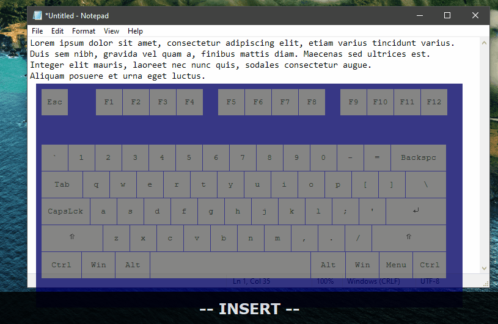

# Windows Vim Mode

<p align="center">
  
</p>

Windows Vim Mode enables systemwide vim-like shortcuts on Windows. This is a fork of [vim-everywhere](https://github.com/lubokkanev/vim-everywhere), originally written by lubokkanev. It is written to be modular and as minimalistic as possible, and only emulate vim keypresses by sending Ctrl and Shift combinations. Some movement commands (such as `ct<char>`) are emulated by temporarily copying text from the current line, sending the appropriate movement keys and then restoring the clipboard to its original state.

<p align="center">
  
</p>

# Commands

Here is a partial list of available commands:

## Insert mode

Insert mode does nothing other than allowing you to enter `Normal` mode by pressing `Ctrl+[` or `Shift+Esc`.

## Normal mode

- Switch to Insert mode: `Esc`, `i`, `a`
- Switch to Visual mode: `v`, `V` (select line)
- Positioning: `0`, `$`, `h`, `j`, `k`, `l`, `4j`, `4k`, `gg`, `G`
- Word navigation: `w`, `b`, `e`
- Copy: `Y`, `y0`, `y$`
- Paste: `p`, `P`
- Text addition/deletion: `A`, `I`, `C`, `c0`, `c$`, `dd`, `D`, `d0`, `d$`, `x`, `X`, `cb`, `cw`, `ce`, `dw`, `diw`, `ciw`, `daw`, `caw`, `r`, `s`, `S`, `<C-w>`
- Repeat commands: `8w`, `5e`, `2b`, `3p`, `3P`
- Scrolling: `<C-u>`, `<C-d>`
- Undo/redo: `u`, `<C-r>`
- Indent: `<<`, `>>`
- Line commands: `o`, `O`, `5o`, `5O`, `J`
- Previous/next: `<C-n>` (&darr;), `<C-p>` (&uarr;)
- Movement commands: `t<char>`, `f<char>`, `T<char>`, `F<char>`
- Action/movement commands: `ct<char>`, `dt<char>`, `yt<char>`, `cf<char>`, `df<char>`, `yf<char>`, `cT<char>`, `dT<char>`, `yT<char>`, `cF<char>`, `dF<char>`, `yF<char>`
- Case swapping commands: `~`

## Normal mode - Explorer commands

Additional Windows Explorer commands are enabled by default and can be disabled in `options.ini` (`ENABLE_WINDOWS_EXPLORER_COMMANDS`):
- Go back in folder history: `p`
- Go forward in folder history: `n`
- Go one folder up: `Shift+p`
- Cut: `x` (when not editing text)

Safety note: when the Explorer module is enabled (which is the default), delete/copy/paste commands are disabled within Explorer (when not editing text) as a safety precaution.

## Normal mode - Additional commands

These commands are not considered vanilla vim and can be disabled in `options.ini` (`ENABLE_ADDITIONAL_COMMANDS`), but are included by default since you might find them useful.

- Simulate mouse scrolling: `m` (scroll down), `,` (scroll up). This will follow your operating system's scrolling setting ('Scroll inactive windows when I hover over them').

## Visual mode

Most of the normal mode commands will work in visual mode. You will most likely end up using one of these:

- Switch to Normal mode: `Esc`
- Switch to Insert mode: `i`, `a`
- Positioning (with selection): `0`, `$`, `h`, `j`, `k`, `l`, `4j`, `4k`, `gg`, `G`
- Word navigation: `w`, `b`, `e`
- Copy: `y`
- Selection/movement commands: `vt<char>`, `vf<char>`, `vT<char>`, `vF<char>`
- Case swapping commands: `~`, `gu`, `gU`
- Text addition/deletion: `s`, `x`, `d`

## All modes

- Reload windows-vim-mode: `Ctrl+Shift+Win+R`, customizable in `options.ini`.
- Exit windows-vim-mode: `Ctrl+Shift+Win+X`, customizable in `options.ini`.
- Open `options.ini` with your default text editor: `Ctrl+Shift+Win+S`, customizable in `options.ini`.

# Installation and usage

You can either download and execute the script directly with [AutoHotkey v1](https://github.com/AutoHotkey/AutoHotkey/releases/tag/v1.1.37.01), or download and execute the pre-compiled binaries. This code was only tested with AutoHotkey v1.1.37.01, and will not run with AutoHotkey v2. Using earlier versions of AutoHotkey v1 might break some functionality. Only Windows 10 22H2 and Windows 11 22H2 were tested and confirmed to work, although it might work with earlier Windows versions.

## As a script
- Download the source code.
- Open **windows-vim-mode.ahk** with [AutoHotkey v1](https://github.com/AutoHotkey/AutoHotkey/releases/tag/v1.1.37.01).

## Compiled version
- Download and unzip the binaries.
- Open **windows-vim-mode.exe**.

## Usage
- Press `Ctrl+[` or `Shift+Esc` to switch to `Normal` mode. Using `Shift+Esc` with Capslock remapped as Esc is recommended.
- Use vim-like shortcuts systemwide.
- Press `Esc`, `i` or `a` to return to `Insert` mode, or `v` to enter `Visual` mode.

# Tips

- You can customize `options.ini` after the first boot. By default, you can restart and apply your options by pressing `Ctrl+Shift+Win+R`.
- I strongly suggest using `Shift+Capslock` to enter `Normal` mode. This will allow your hands to be properly positioning for high-likelihood proceeding commands (such as h/j/k/l/w/v/b/f/t/c).
- I strongly suggest using [AutoHotkey](https://github.com/AutoHotkey/AutoHotkey) or [Microsoft PowerToys](https://github.com/microsoft/PowerToys) to remap `Esc` to `Capslock` and `Capslock` to `Esc`, since this is the way vim was [originally meant to be used](https://vim.fandom.com/wiki/Avoid_the_escape_key). With AutoHotkey, this can be accomplished by running the following 2-line script (as a separate script/process):
```
Esc::Capslock
Capslock::Esc
```

# Permissions, security and running automatically at startup

Some applications running with elevated privileges (such Task Manager, Windows Settings and other system tools) will completely ignore external input from an application being run with normal privileges. Run this application as administrator if you wish to send input to such applications.

If you wish this application to run automatically at startup (with or without elevated privileges), or if you are concerned about security (false positives), see the [shared project documentation](https://github.com/vieuxtemps/ahk-shared-docs).

# Notable changes from vim-everywhere
- Timer-based On-screen Display (OSD) for the current mode, including for numbered/repeat commands (such as `5p` or `5w`).
- Safer and more reliable code for sending keypresses, most notably fixed an issue where holding `w` to navigate between words could trigger a tab or window being closed by sending `Ctrl+W` by accident.
- Cleaned up and better organized codebase. Some unused and application-specific functions were removed and all hotkeys that remain were made to resemble vanilla vim.
- Fixed tray icons (visual mode now has its own icon).
- `Esc` can now be used to exit modes.
- Better mode transitions when exiting modes (`Visual` &rarr; `Normal` &rarr; `Insert`). Transitioning from `Visual` to `Normal` instead of `Insert` seems to work better for real-world text selection scenarios.
- Customizable options (see `options.ini`).
- Many fixes for textboxes that are delay-sensitive.
- Code for numbered/repeated commands (e.g. `5p`) and multiple key commands (e.g. `ciw`) was completely rewritten and made more readable.
- Numbered/repeated commands are now limited to 25 by default to prevent catastrophic scenarios.
- Improved cursor positioning when leaving `Visual` mode.
- Movement commands were added, such as `f<char>`, `T<char>`, `ct<char>`, `vf<char>`, etc.
- Case swapping commands were added.
- Many other fixed/new commands.

# Similar and recommended tools

## Browser (Chromium/Firefox)

- [Vimium](https://github.com/philc/vimium)

## Visual Studio Code

- [VSCodeVim](https://github.com/VSCodeVim/Vim), [vscode-neovim](https://github.com/vscode-neovim/vscode-neovim)

## Windows

- [vim-everywhere (the original)](https://github.com/lubokkanev/vim-everywhere)
- [mouseable](https://github.com/wirekang/mouseable)
- [TextEditorAnywhere](https://www.listary.com/text-editor-anywhere)

## macOS

- [Karabiner-Elements](https://github.com/pqrs-org/Karabiner-Elements)
- [Hammerspoon](https://github.com/Hammerspoon/hammerspoon) + [VimMode.spoon](https://github.com/dbalatero/VimMode.spoon)

## Linux/macOS

- [warpd](https://github.com/rvaiya/warpd)
- [vim-anywhere](https://github.com/cknadler/vim-anywhere) (good-enough TextEditorAnywhere alternative, not to be confused with vim-everywhere)